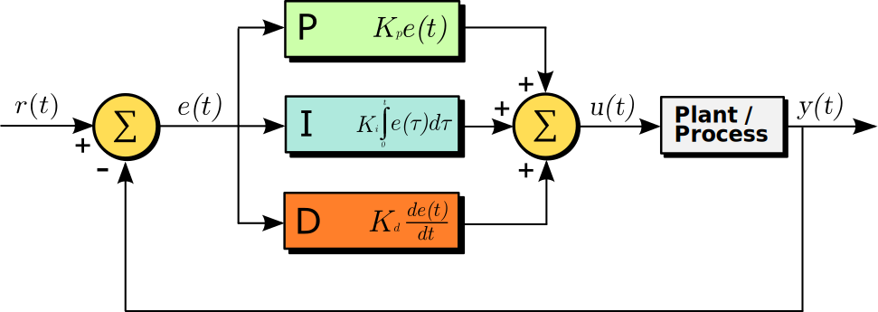

# PID Controller for Assisted Lane Keeping of an Autonomous Vehicle


## Introduction
In this project, a PID controller is implemented to assist an autonomous vehicle to stay centered in the driving lane. The input to the PID controller is the error parameter called as cross track error. Cross track error is the value that the vehicle is away from the center of the road between two waypoints. The PID controller takes this as an input and manipulates the steering value to keep the vehicle centered in the lane.

A Proportional Integral Derivative (PID) controller is a closed loop controller that uses a feedback loop and is widely used and has application in a variety of industries. The PID control algorithm constantly calculates an error value which is the difference between the setpoint value and the measured process variable. It applies correction based on the Proportional Integral and Derivative gain values. The figure below shows the block diagram of a PID controller.



## Project Build Instructions
### Ubuntu
``` bash
git clone
cd
mkdir build && cd build
cmake ..
make
./pid
```

## Build Dependencies
* cmake >= 3.5
  * All OSes: [click here for installation instructions](https://cmake.org/install/)
* make >= 4.1 (Linux, Mac), 3.81 (Windows)
  * Linux: make is installed by default on most Linux distros
  * Mac: [install Xcode command line tools to get make](https://developer.apple.com/xcode/features/)
  * Windows: [Click here for installation instructions](http://gnuwin32.sourceforge.net/packages/make.htm)
* gcc/g++ >= 5.4
  * Linux: gcc / g++ is installed by default on most Linux distros
  * Mac: [install Xcode command line tools](https://developer.apple.com/xcode/features/)
  * Windows: recommend using [MinGW](http://www.mingw.org/)
* [uWebSockets](https://github.com/uWebSockets/uWebSockets)
  * run `./install-ubuntu.sh` or `./install-mac.sh` depending on your platform
* Simulator
  * The simulator can be downloaded from the [Udacity GitHub Repository](https://github.com/udacity/self-driving-car-sim/releases)

## References
1. The starter code and the simulator is adopted from the [Udacity GitHub Repository](https://github.com/udacity/CarND-PID-Control-Project)
2. https://en.wikipedia.org/wiki/PID_controller
